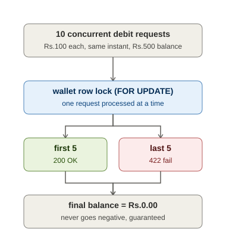

# Decision Log

## 1. How did you handle the concurrency race condition?

I used **database-level pessimistic row locking** rather than an
application-level lock (like a `synchronized` block or a `ConcurrentHashMap`
of per-user locks).

Flow inside `TransactionService.process()`:
lets understand this via the example instead of just long description:
suppose we have 10 request concurrently eg->req1,req2..,re10;

1)All 10 line up for the DB row lock first. As shown in the diagram, the lock lets in only one request at a time. The other 9 wait.

2)Say req7 gets the lock first (the order is random, as I mentioned earlier — it's not "whoever was created first"). It sees balance = ₹500, deducts ₹100, new balance = ₹400, commits, releases the lock, returns 200 OK.

3)Now req3 gets the lock next. It sees balance = ₹400 (req7's commit is already visible), which is still ≥ ₹100, so it also succeeds — balance = ₹300, 200 OK.
This continues one by one until 5 requests have succeeded, and the balance is now exactly ₹0.

4)The 6th request to get the lock (could be any of req1, req2, req4, req5, req6, req8, req9, req10 — whatever turn it is) checks, balance = ₹0, but it wants to deduct ₹100. Since 0 < 100, it fails with InsufficientFundsException → 422 Unprocessable Entity. This same thing then happens to the remaining 4 requests too.

Below is the Explanation in technical Language;(like what method are getting called and what is happening in process() method of TransactionService class)

1. A cheap, non-locking `existsByTransactionId` check runs first, purely as a
   fast path to reject an already-committed duplicate without paying for a
   row lock.
2. The service then calls `WalletRepository.findByUserIdForUpdate()`, which
   Hibernate translates into `SELECT ... FOR UPDATE` against the wallet row.
   Every request touching that wallet - whether a genuine duplicate or a
   legitimate concurrent debit - now serializes on this line. No second
   transaction can read that wallet row for update until the first one
   commits or rolls back.
3. **Only after acquiring the lock** does the service re-check
   `existsByTransactionId`. This is the authoritative check: if two requests
   for the same `transactionId` arrive together, the loser of the lock race
   will always see the winner's committed `TransactionRecord` by the time it
   gets the lock - so it can never double-process.
4. The balance check (`insufficient funds`) also happens inside the locked
   section, so two concurrent debits can never both read the same starting
   balance and both succeed when only one should.
5. As a final defense-in-depth layer, `transactionId` also has a `UNIQUE`
   constraint at the database schema level. If the application-level checks
   were ever bypassed (e.g. a future code change), the DB itself would reject
   a second insert with a `DataIntegrityViolationException`, which is caught
   and converted into the same 409 response.

## 2. Where did your AI assistant give an incorrect or sub-optimal suggestion?
THe first issue was due to some versioning like Java 21 and 25 but i corrected it thriugh the logs 
Earlier the ai gave me the optimistic locking approach But after some research ,I got my way ->
There are 3 types of Locking Pessimistic,Optimistic,Distributed
however Distributed locking will not show up here as there is only single service so i didnt consider here that 
But Then AI suggested me the Optimistic strategy ,But in Financial System there are flaws of this Approach ->

1)High Conflict Rates: Optimistic locking assumes data conflicts are rare. In banking, multiple processes frequently hit the same account or balance simultaneously, causing most transactions to fail at commit time.
 
2)Retry Storms: When a transaction fails a version check, the application must retry the entire read-modify-write cycle. Under heavy load, thousands of concurrent retries overload the database and degrade system performance further. 

So after understanding the Pros and Cons of Both I got to the Pessimistic Approach 

One thing to notice is we can also achieve the Pessimistic approach via ConcurrentHashMap But it has soe cons too..
It does block/wait but the lock lives in Java's heap memory, inside a single running JVM process — not in the database.This will cause the issue in production if we have two instances of the same service running in two different JVM's as they wont be able to sync each other and will cause the race condition to happen. 

Exceptions-> I created the Custome Exceptions cause the Spring's Exception are built for the Status+ Strings not to carry Objects  
Thats it for this Assignment 

Following is the link that helped me for Decision making between locking
https://medium.com/@krichenenour2/optimistic-locking-vs-pessimistic-locking-in-plain-english-726a2c53a3eb

